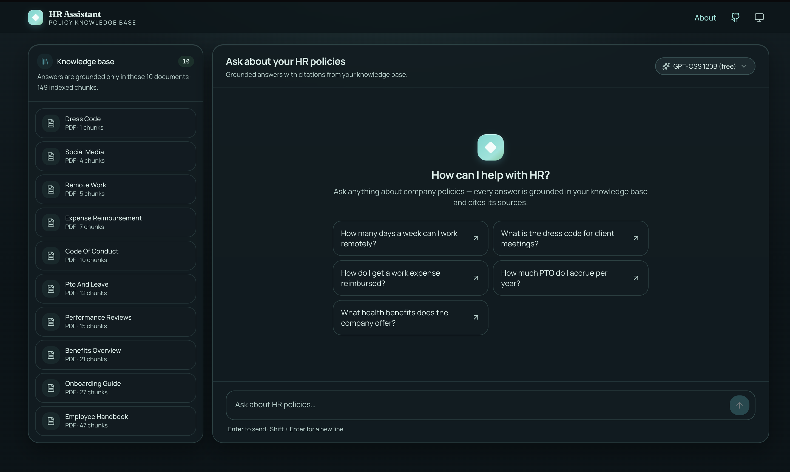
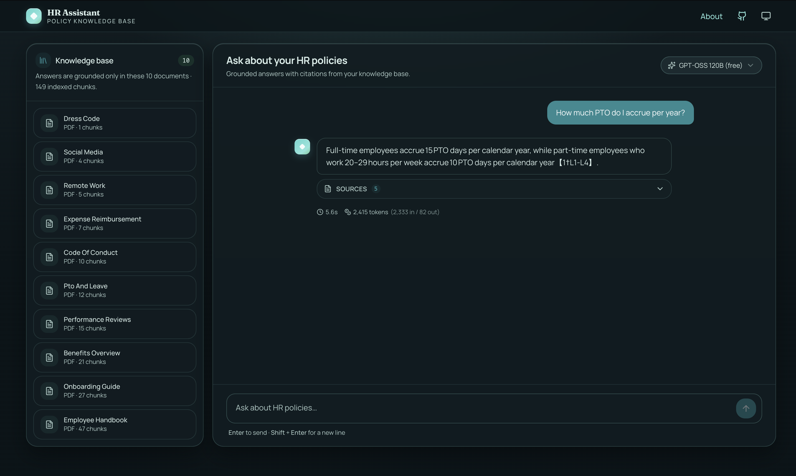
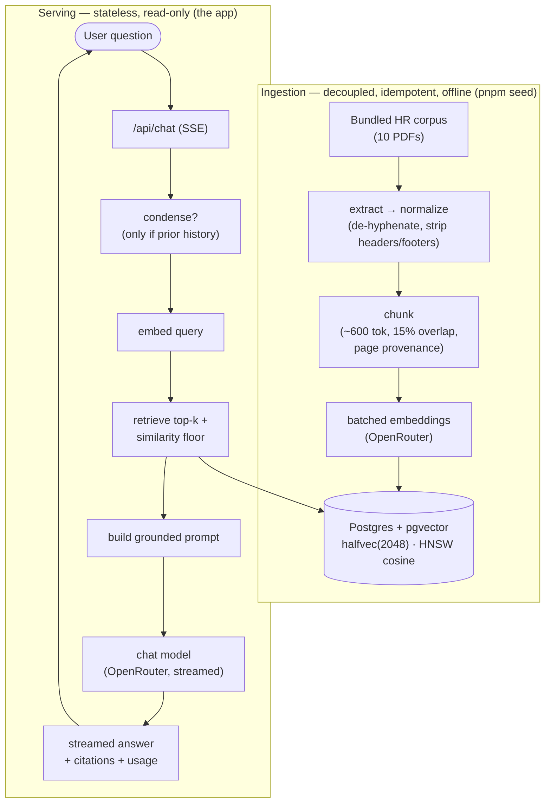

# HR Assistant — Chat With Your HR Docs

A grounded, citation-backed RAG chat over a company's HR policy documents. Ask a natural
question ("How much PTO do I accrue?", "What's the remote-work policy?") and get an answer
synthesized **only** from the seeded handbook, with the exact source passages, page numbers
and similarity scores it used — plus a per-answer token/latency readout.

Built on **TanStack Start** (React 19) · **Postgres + pgvector** · **OpenRouter** (one key for
both chat and embeddings) · a hand-written RAG pipeline (no LangChain).





---

## Quick start (from a fresh clone)

**Prerequisites:** Docker (Compose v2) and a free OpenRouter API key — grab one at
<https://openrouter.ai/keys> (~60s). The same key powers both chat and embeddings; the
defaults are `:free` models, so a $0 key runs the whole thing end to end.

```bash
cp .env.example .env
# open .env and paste your key into OPENROUTER_API_KEY=
docker compose up
```

Then open <http://localhost:3000>.

That single command brings up three things (see [Architecture](#architecture)):

1. **`db`** — Postgres + pgvector with a persistent volume.
2. **`migrate-seed`** — a one-off job that applies migrations and ingests the bundled HR
   corpus, then exits. It's **idempotent**: the first `up` seeds once (a few seconds); every
   later `up` re-embeds nothing and is effectively instant.
3. **`app`** — the stateless web server, which only starts once seeding has completed.

No key yet? The app still boots and the chat shows a clear inline banner instead of a 500.

### Health check

```bash
curl localhost:3000/health
# {"status":"ok","database":"up","chunks":149}
```

`ok` = DB reachable and the index is populated · `degraded` = reachable but empty (seed not
run) · `down` = DB unreachable. Returns `200` for `ok`, `503` otherwise.

### Local development (without containerizing the app)

```bash
docker compose up -d db        # just Postgres + pgvector
pnpm install
pnpm db:migrate                # apply schema
pnpm seed                      # ingest the bundled corpus
pnpm dev                       # http://localhost:3000
```

All four `pnpm` scripts read `OPENROUTER_API_KEY` (and the rest) from `.env` automatically.

### Useful scripts

| Command | What it does |
| --- | --- |
| `pnpm dev` | Dev server with HMR |
| `pnpm build` / `pnpm start` | Production build / serve it (client assets + SSR fetch handler via `srvx`) |
| `pnpm db:migrate` / `pnpm seed` | Apply migrations / ingest the corpus |
| `pnpm test` | Unit suite (pure, CI-safe — no DB or network) |
| `pnpm test:integration` | The one local-only ingest→retrieve test (needs the DB up + a key) |
| `pnpm typecheck` | `tsc --noEmit` |

---

## Architecture



**Why the two halves are strictly separated:** ingestion is a standalone, idempotent command
that the app server *never* runs. The vector store is persistent; the serving layer only
reads. This keeps app boot instant (no startup ingestion), lets serving scale horizontally
without replicas racing to embed, and uses the *same code path* locally and in production —
a future interactive-upload feature drops in as a second caller of the shared `ingest()`.

### Stack & layout

- **Framework:** TanStack Start + TanStack Router (file routes), Vite 8, Tailwind v4.
- **AI:** `@tanstack/ai` with the OpenRouter adapter (chat + embeddings through one key).
- **Data:** Drizzle ORM over Postgres + `pgvector`.
- **Serving the prod build:** `srvx` serves the client assets and forwards everything else
  to the Vite build's fetch handler (`dist/server/server.js`). There's no built-in
  node-server target, so this is the documented self-host path.

```
src/
  routes/
    index.tsx          # the chat page (chat panel + knowledge-base panel)
    api/chat.ts         # grounded streaming RAG endpoint (SSE)
    health.ts           # /health liveness + DB/index check
  lib/
    ingest/             # extract · normalize · chunk · ingest (the offline pipeline)
    retrieval.ts        # embed query → searchChunks (vector search)
    grounding.ts        # similarity floor, grounded prompt, citation assembly
    condense.ts         # conversational query condensation
    observability.ts    # per-turn structured log + usage extraction
    openrouter.ts       # the single provider seam (chat, complete, embed)
    config.ts           # all env-driven knobs in one place
  components/chat/       # ChatPanel, Citations, MessageMeta, ModelPicker, …
scripts/                # migrate.ts, seed.ts (run via tsx as one-off jobs)
corpus/                 # the bundled synthetic HR handbook (10 PDFs)
drizzle/                # SQL migrations
```

### A request, end to end

1. **Condense (only with history).** First message in a thread skips this. On follow-ups, one
   free-model call rewrites "what about part-time employees?" + a capped history window into a
   standalone query — so retrieval finds the right chunks. Generation still answers the user's
   actual question; only *retrieval* uses the rewritten query.
2. **Embed** the (possibly rewritten) query.
3. **Retrieve** the top-k chunks by cosine similarity, then apply a permissive **similarity
   floor**. If *every* hit is below the floor, the UI shows a distinct empty state instead of
   inviting a hallucination.
4. **Ground & generate.** A system prompt instructs the model to answer *only* from the
   retrieved context and to say so when the answer isn't there. The answer streams over SSE.
5. **Trailers.** Once generation finishes, the citations (doc · page · snippet · score) and
   the token-usage + latency ride out as trailing events the client binds to the message.

---

## RAG & LLM decisions

These are the load-bearing choices. The full decision log — including the alternatives
rejected and why — lives in [`DECISIONS.md`](DECISIONS.md).

- **Free-by-default, env-swappable models.** Chat defaults to `openai/gpt-oss-120b:free`;
  every model is overridable via env (`DEFAULT_CHAT_MODEL`, `DEFAULT_EMBEDDING_MODEL`,
  `CONDENSE_MODEL`) so the release swap to a paid-reliable model is a one-line change, no code.
- **Embeddings: free NVIDIA Nemotron.** `nvidia/llama-nemotron-embed-vl-1b-v2:free`. OpenRouter
  has *no* $0 embedding models that bill against a balance, so this free hosted slug is the
  only path that's end-to-end free on a fresh key **and** keeps the single-provider elegance.
  Embeddings are **batched** (`input: [...]`), so a whole-handbook ingest is a handful of calls.
- **`halfvec(2048)` + HNSW.** Nemotron emits 2048-d vectors, which exceeds pgvector's 2000-d
  ceiling on the `vector` index type. `halfvec` raises the index limit to 4000 dims, halves
  storage, and has negligible recall loss. Cosine distance, cast at query time.
- **Chunking built for PDFs.** A hand-written, boundary-aware recursive splitter (paragraph →
  line → sentence → token cap, with overlap), ~600 tokens / ~15% overlap (both configurable).
  PDFs are **normalized before chunking** — de-hyphenation across line breaks, whitespace
  collapse, repeated header/footer + bare page-number stripping. **Page provenance** is carried
  through by recording page-boundary offsets and mapping each chunk's start offset to a page.
- **The "I don't know" guardrail.** The *prompt* is the primary mechanism, backed by a low,
  permissive similarity floor (`RETRIEVAL_MIN_SCORE`) that only drops obvious garbage and
  drives the empty state. A false "I don't know" on a valid question is a far worse demo
  failure than passing a slightly-weak chunk to a model that then declines — so the floor is
  deliberately permissive and embedder-calibrated, not a hardcoded blog number.
- **Conversational memory via lazy condensation** (described above) — the standard
  conversational-RAG pattern, applied lazily so the common first-message case stays fast.
- **Citations show their work.** Each source card carries doc name, page (for PDFs), the exact
  retrieved snippet, and a similarity-score badge — verifiable grounding at modest cost.
- **Model picker with graceful degradation.** Premium models (Claude, GPT, Gemini) are
  selectable and marked "requires credit"; choosing one on a $0 key produces a friendly hint,
  not a raw 402. Condensation always runs on the free model regardless of the picker, so
  premium answer-models don't quietly double-charge every follow-up.

---

## Observability

- **One structured pino log per turn**, keyed by a `requestId`: the question, whether
  condensation ran, the retrieved chunk ids + scores + docs, the model, token usage, and
  per-stage latency (condense / embed / retrieve / generate / total).
- **`/health`** — liveness plus DB connectivity and an index-populated check.
- **In-UI readout** — every answer shows its turn latency and token usage, sourced from the
  stream's usage event. Doubles as observability and as a small trust signal.

---

## Testing

- **CI-safe unit suite** concentrated where parsing logic actually lives and can break:
  chunking boundaries/overlap/token-cap, PDF normalization, page-provenance mapping,
  prompt/context assembly (history + token caps, condense-vs-skip), retrieval ranking + floor
  cutoff + empty state, and the observability/health builders. All with stubbed embedder/LLM
  boundaries — no network, no DB, no flakiness, no cost.
- **One integration test** (`pnpm test:integration`) exercises the real ingest→retrieve path
  against the compose DB and a live embedder. It's env-guarded and **skipped in CI** (no
  Testcontainers, no cost-bearing tests on the hot path).

---

## Engineering standards

**Followed:** a single provider seam (`openrouter.ts`) that keeps the pipeline provider-
agnostic and the units network-free; all tunables centralized in `config.ts`; deep modules
behind small interfaces (`ingest()`, `retrieve()`, `checkHealth()`); secrets only ever in
`process.env` / server code, never `VITE_*` or the client bundle; no secret committed to the
repo; descriptive identifiers throughout; typed end to end; idempotent migrations and seed.

**Consciously skipped (time-boxed at ~1–2 days):** comprehensive coverage of every edge
(high-ROI parsing tests kept, exhaustive ones not); UI E2E (Playwright); an LLM answer-quality
eval harness; auth / multi-tenancy. These are deliberate scope cuts, not oversights — see
[What I'd do next](#what-id-do-next).

---

## Productionizing on a hyperscaler

The local compose topology maps one-to-one onto managed cloud primitives:

- **Vector DB → managed Postgres + pgvector** (RDS / Cloud SQL / AlloyDB). The persistent
  volume becomes a managed instance with backups and PITR.
- **`migrate-seed` → a decoupled one-off job** (Cloud Run Job / ECS RunTask / K8s Job),
  CI-triggered after migrations, writing to the managed store. Same command, same idempotency.
- **`app` → a stateless autoscaled service** (Cloud Run / ECS / Deployment + HPA). It only
  reads, so it scales horizontally with no coordination and never embeds on the hot path.
- **Secrets** move from `.env` to a secrets manager; the OpenRouter key (or a swapped-in
  first-party provider) is injected at deploy.
- **Observability** graduates from structured logs to OpenTelemetry spans/traces, a metrics
  backend (Prometheus/Grafana or the cloud-native equivalent), and an eval dashboard.

Because ingestion is already decoupled and the app is already stateless and read-only, this is
a deployment-topology change, not a rewrite.

---

## How I used AI tools

This project was built with an AI agent (Claude) as a hands-on collaborator, but the
*architecture* was driven by an adversarial **grilling** session *before* any code: every
decision in [`DECISIONS.md`](DECISIONS.md) was pressure-tested for alternatives and failure
modes, and several AI suggestions were rejected or redirected — keeping the RAG pipeline
hand-written and legible instead of reaching for LangChain; rejecting Matryoshka truncation to
fit pgvector's `vector` ceiling in favor of `halfvec`; rejecting a high hard similarity floor
in favor of a prompt-first guardrail. The agent then implemented the system layer by layer
(walking skeleton → ingest/retrieve → grounded generation → UI polish → PDF/condensation →
observability/tests → this packaging pass), test-first where the logic was pure.

`DECISIONS.md` is the authoritative, human-owned record of *why*; this README is drafted from
it. The point of the workflow: use AI to move fast on implementation, but keep the reasoning,
the trade-offs, and the rejected roads explicitly mine.

---

## What I'd do next

- **Interactive upload UI** — a second caller of the shared `ingest()`; the architecture
  already accommodates it.
- **Click-to-highlight citations** — open the source PDF to the exact retrieved span.
- **Reranking / MMR** and **hybrid (keyword + vector) search** for higher retrieval precision.
- **An LLM answer-quality eval harness** — a small graded question set run in CI against a
  fixed model, to catch retrieval/grounding regressions.
- **Auth & multi-tenancy** — per-organization corpora and access control.
- **OpenTelemetry + a metrics backend** to complete the observability story.

---

## Known limitations

- **Free-tier models** carry shared rate limits and occasional slug-stability churn; the
  embedder is tuned for multimodal QA retrieval rather than pure-text SOTA. Both are mitigated
  by the env-swap to a paid model on release.
- **Pre-seeded corpus only** — no runtime upload yet (by design; see above).
- **PDF extraction** handles prose well but does **not** reconstruct tables, multi-column
  layouts, or scanned/OCR documents.
- **Changing the embedding model's dimension** requires re-indexing (drop + re-`seed`), since
  the `chunks.embedding` column is a fixed `halfvec(2048)`.

---

## Environment variables

See [`.env.example`](.env.example) for the complete annotated list. The only **required** one
is `OPENROUTER_API_KEY`; everything else has a sensible default.
